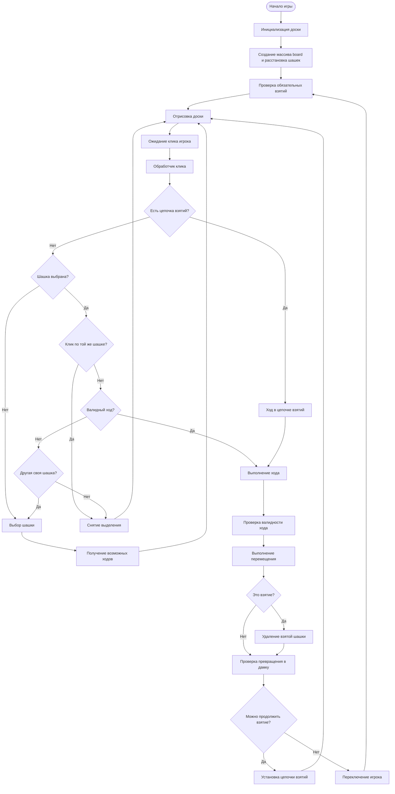
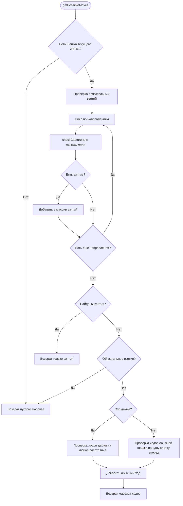
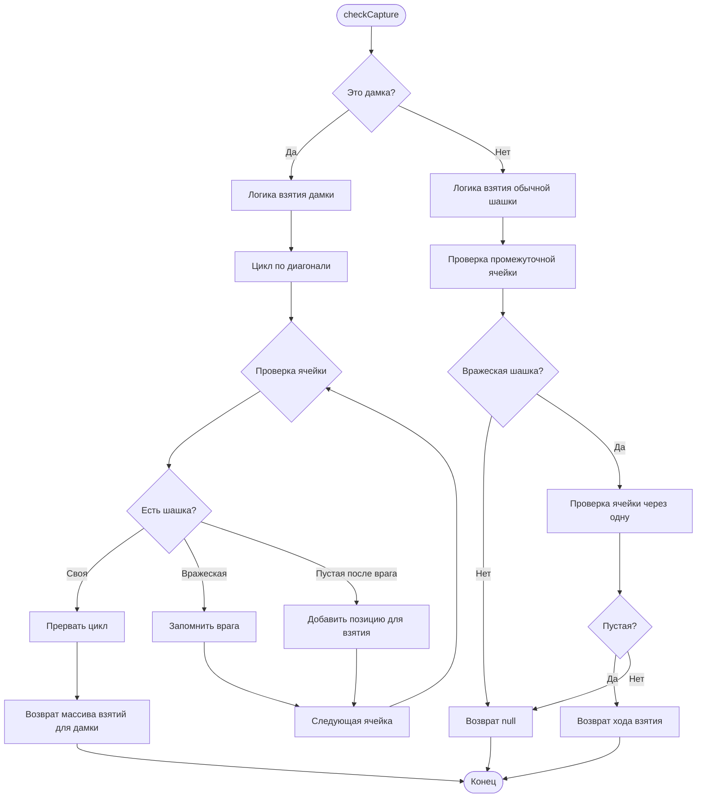
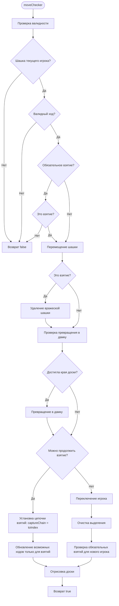
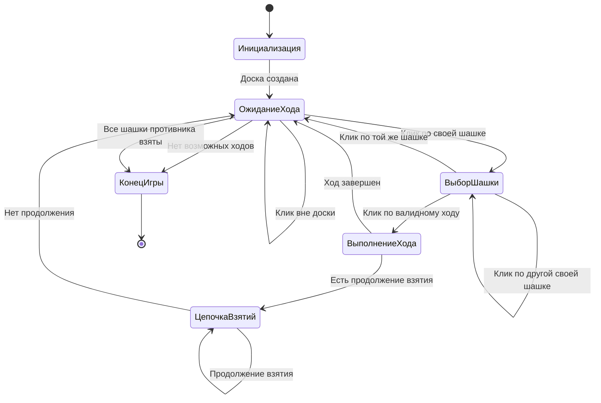
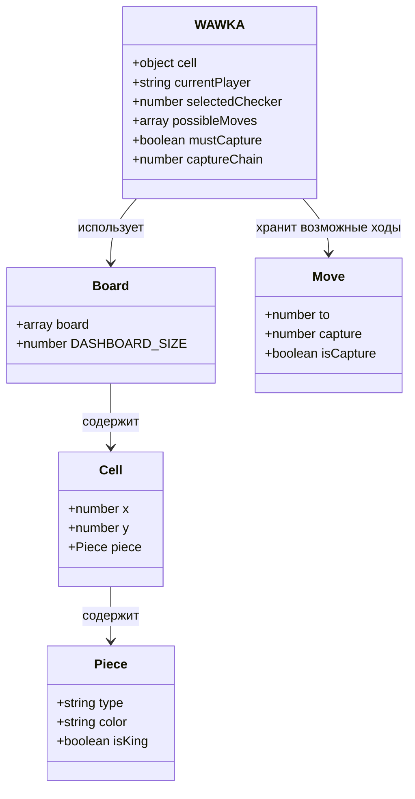
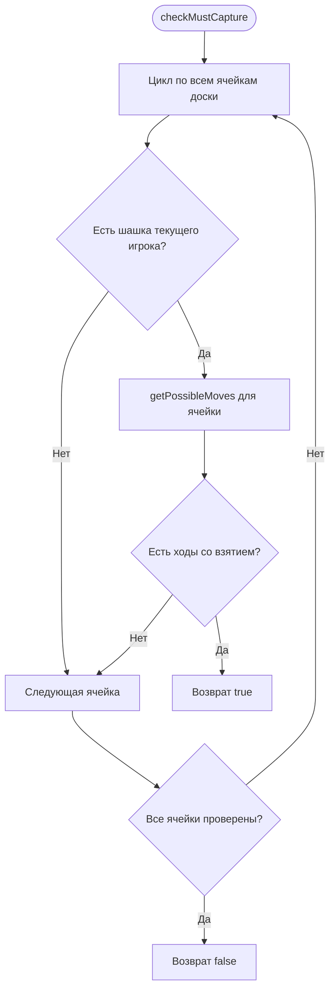

# Схема логики игры в шашки

## Основной поток игры

## Логика проверки возможных ходов

## Логика взятия шашек

## Логика выполнения хода

## Состояния игры

## Структура данных

## Алгоритм проверки обязательных взятий

